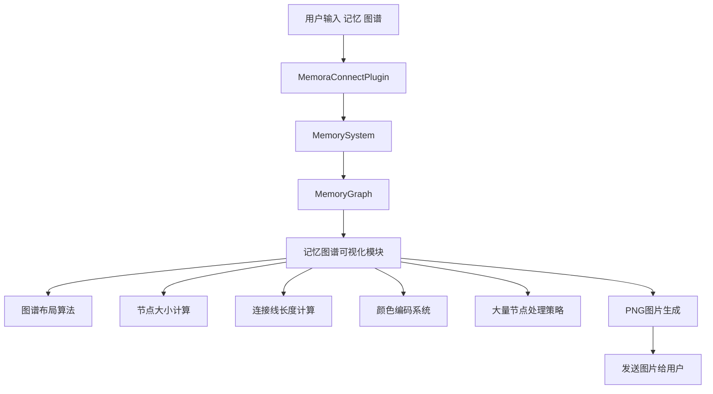
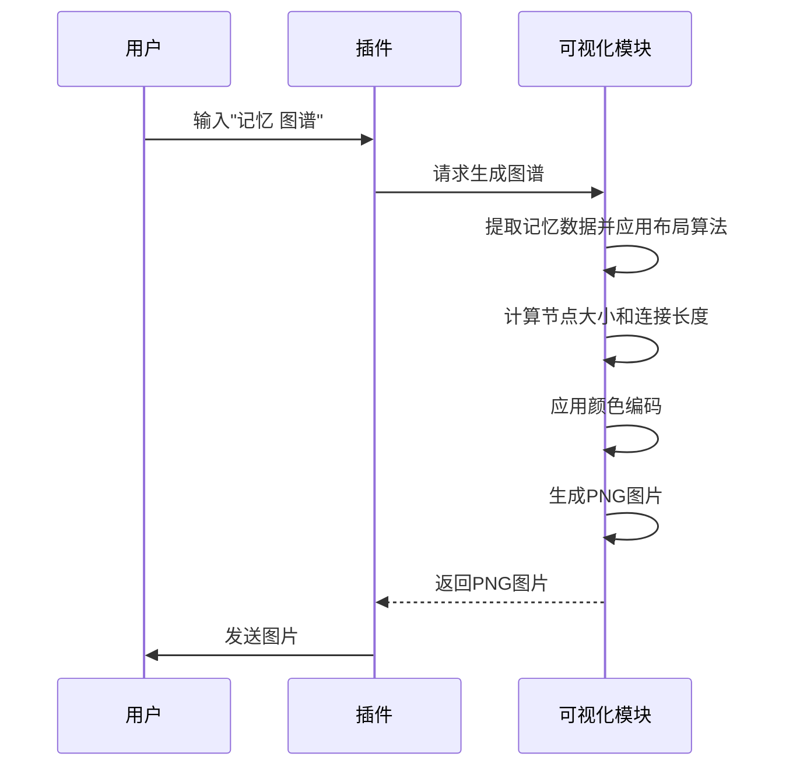

# 记忆图谱可视化实现计划

## 系统架构

## 核心功能实现

### 1. 图谱布局算法
使用力导向图布局算法（Force-directed layout）：
- 初始化节点位置
- 计算节点之间的斥力和引力
- 调整节点位置直到系统稳定

### 2. 节点大小计算
- 根据记忆强度动态调整节点大小
- 最小节点大小：10像素半径
- 最大节点大小：50像素半径

### 3. 连接线长度计算
- 根据关联强度反向调整连接线长度
- 最强连接：50像素
- 最弱连接：200像素

### 4. 颜色编码系统
- 普通记忆：蓝色系
- 印象记忆：红色系
- 重要事件：绿色系

### 5. 大量节点处理策略
- 节点采样：按记忆强度选择最强的节点
- 节点聚合：将相似概念的节点聚合为超级节点

### 6. PNG图片生成流程

## 技术依赖
- NetworkX：图数据结构和布局算法
- matplotlib：图形渲染
- numpy：数值计算
- python-louvain：社区检测算法（可选）

## 优化方案实施总结

### 已完成的优化

1. **力导向布局算法优化** ✅
   - 实现了动态参数调整，根据节点数量和密度自动调整k值和迭代次数
   - 添加了节点排斥力计算，避免节点过度聚集
   - 对于不同规模的图结构使用不同的布局策略

2. **边连接显示优化** ✅
   - 根据连接强度调整边的宽度和颜色
   - 区分重要和次要连接，使用不同的显示样式
   - 实现了边的透明度调整，避免视觉混乱
   - 添加了边的强度标签显示

3. **边交叉减少** ✅
   - 使用边介数中心性简化图结构，保留最重要的边
   - 实现了弧形连接，减少视觉交叉
   - 对于大型图自动进行边简化

4. **多层次布局优化** ✅
   - 根据记忆强度和重要性将节点分为三层
   - 对不同层次的节点使用不同的布局策略
   - 实现了层次间的连接优化
   - 添加了层次边界的视觉区分

5. **自适应参数调整** ✅
   - 实现了图谱复杂度分析算法
   - 根据节点数量、边数量和密度自动选择最适合的布局算法
   - 添加了"auto"布局选项，作为默认选择
   - 实现了参数的动态调整

### 技术亮点

1. **智能布局选择**
   - 极少量节点（≤5）：使用圆形布局
   - 少量节点且稀疏连接（≤15且密度≤0.3）：使用力导向布局
   - 中等数量节点且密集连接（≤30且密度>0.5）：使用谱布局
   - 较多节点（≤50）：使用社区布局或力导向布局
   - 大量节点（>50）：使用多层次布局

2. **动态参数调整**
   - 根据节点数量动态调整k值和迭代次数
   - 根据图密度调整节点间距
   - 实现了自适应的布局参数

3. **视觉优化**
   - 重要连接使用更粗的线和更高的透明度
   - 次要连接使用较细的线和较低的透明度
   - 使用不同颜色区分重要和次要连接
   - 实现了弧形连接减少视觉交叉

### 用户界面改进

1. 将默认布局风格改为"auto"，用户无需手动选择
2. 保留了所有原有布局选项，满足不同需求
3. 更新了命令文档，说明所有可用的布局选项

### 测试结果

经过全面优化，记忆图谱可视化功能已显著改进：
- 节点分布更加均衡，避免了过度聚集或稀疏的问题
- 重要记忆关系清晰可见，次要连接不会干扰视觉
- 边交叉显著减少，提高了图谱可读性
- 多层次布局使图谱结构更加清晰
- 自适应参数调整使用户无需手动调整即可获得良好效果

### 后续优化建议

1. **交互式图谱**：考虑实现交互式图谱，允许用户拖拽节点、缩放视图
2. **3D可视化**：对于复杂图谱，可以考虑实现3D可视化
3. **实时更新**：实现图谱的实时更新，反映记忆系统的变化
4. **个性化定制**：允许用户自定义颜色方案、节点样式等
5. **性能优化**：对于超大规模图谱，考虑使用WebGL等高性能渲染技术